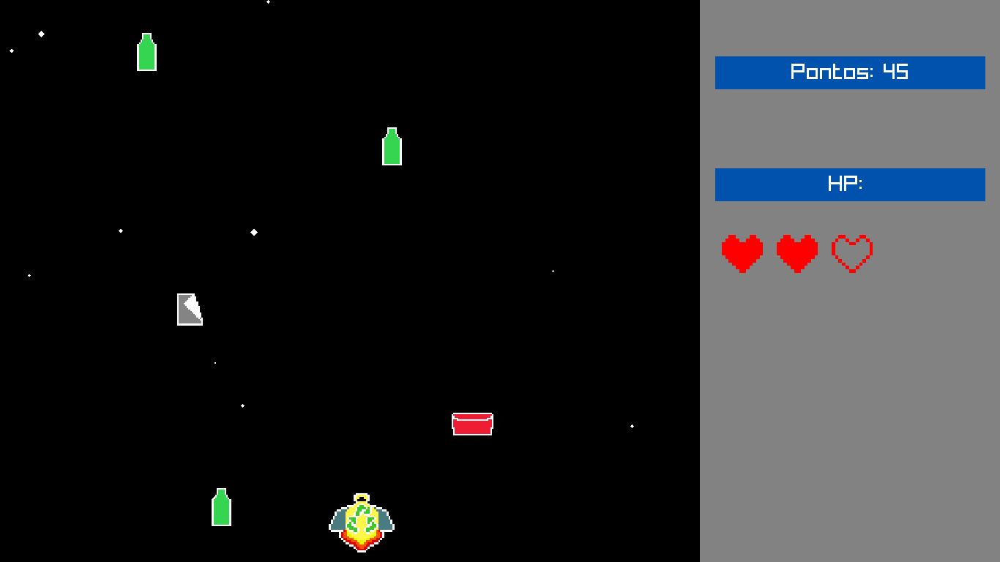

# SpaceRecycle Game

Spaceship recycling game using [raylib](https://github.com/raysan5/raylib)



## How to play

### Moving
W or ARROW_UP: UP \
A or ARROW_LEFT: LEFT \
S or ARROW_DOWN: DOWN \
D or ARROW_RIGHT: RIGHT

### Changing spaceship type
1: Paper \
2: Glass \
3: Plastic \
4: Metal \
5: Organic

## Building

### Requirements

Game Library - [raylib](https://github.com/raysan5/raylib) \
C++ Wrapper - [raylib-cpp](https://github.com/RobLoach/raylib-cpp/tree/master) \
Builder - [CMake](https://cmake.org)

### Steps

```bash
git clone (this repo) SpaceRecycle
cd SpaceRecycle

cmake -S . -B build
cd build && make
cd ..
```

Then run the `bin/SpaceRecycle` executable.
